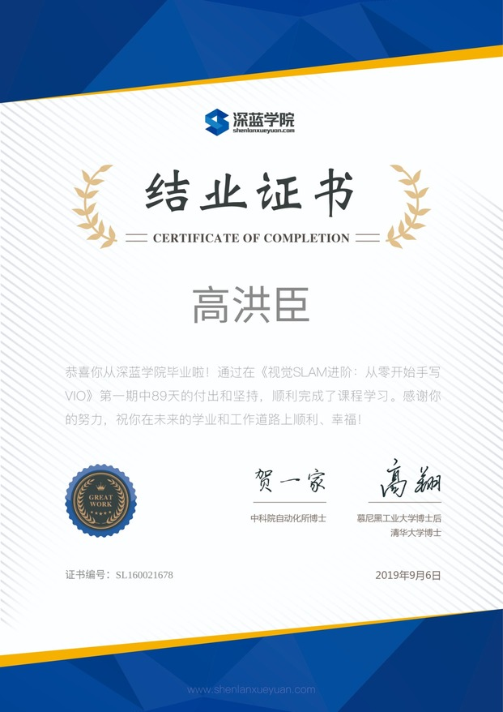

# Shenlan VIO Course

深蓝学院《视觉SLAM进阶：从零开始手写VIO》第一期

-----

## Contents

* [x] 第1讲 概述与课程介绍
* [ ] 第2讲 IMU 传感器
* [ ] 第3讲 基于优化的IMU与视觉信息融合
* [ ] 第4讲 基于滑动窗口算法的VIO系统：可观性和一致性
* [x] 第5讲 后端优化实践：逐行手写求解器 !!!
* [x] 第6讲 视觉前端
* [x] 第7讲 VINS初始化和VIO系统
* [x] 第8讲 VINS回顾与展望

## Certificate

  

