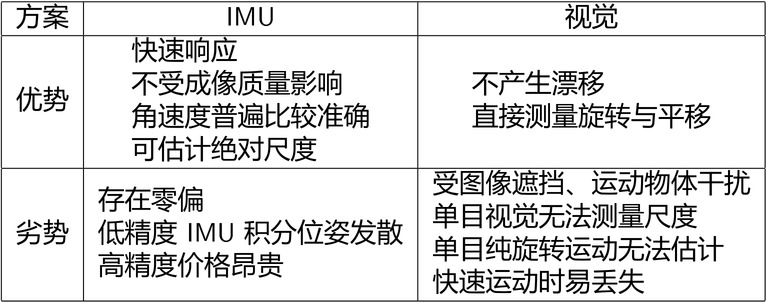
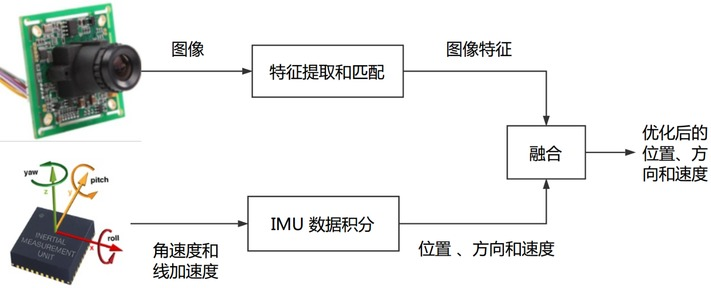

# 第1讲 概述与课程介绍

VIO (Visual-Inertial Odometry): 以视觉与 IMU 融合实现里程计

-----

[TOC]

## IMU v.s. 视觉

整体上,视觉和 IMU 定位方案存在一定互补性质：  
* IMU 适合计算短时间、快速的运动，可以为视觉提供快速运动时的定位；
* 视觉适合计算长时间、慢速的运动，可利用视觉定位信息来估计 IMU 的零偏，减少 IMU 由零偏导致的发散和累积误差。

  

## IMU数据可与多种定位方案融合

* 自动驾驶中通常用 IMU+GPS/差分 GPS/RTK 的融合定位方案，形成 GNSS-INS 组合导航系统,达到厘米组定位精度；
* 头戴式 AR/VR 头盔则多使用视觉 +IMU 的 VIO 定位系统，形成高帧率定位方案

## 松耦合 v.s. 紧耦合

松耦合：

  

紧耦合：

  

为什么要使用紧耦合：

* 单纯凭(单目)视觉或 IMU 都不具备估计 Pose 的能力：视觉存在尺度不确定性、IMU 存在零偏导致漂移；
* 松耦合中，视觉内部 BA 没有 IMU 的信息，在整体层面来看不是最优的；
* 紧耦合可以一次性建模所有的运动和测量信息，更容易达到最优。
