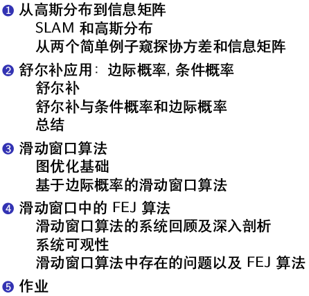

# 第4讲 基于滑动窗口算法的VIO系统：可观性和一致性

-----

  

## References

* The Humble Gaussian Distribution - humble
* Exactly Sparse Extended Information Filters for Feature-Based SLAM - walter07
* Consistency Analysis for Sliding-Window Visual Odometry - ICRA12_TR
