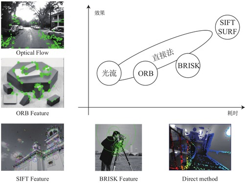

# 第6讲 视觉前端

-----

[TOC]

## Overview

前端的差异就比较明显：
* 追踪算法是否很容易丢失？
* 算法对干扰的鲁棒性如何(光照、遮挡、动态物体)？

算法的结果和数据集关系很大：
* Kitti 属于比较简单的(视野开阔,动态物体少,标定准确)
* EUROC 一般(人工设定场景，纹理丰富，但曝光有变化)
* TUM-Mono 比较难(场景多样，主要为真实场景)

## 特征点提取、匹配和光流

VO 方法的定性比较：

  

## 关键帧

为什么需要关键帧：
* 后端通常实时性较差,不适合处理所有帧；
* 如果相机停止，可能给后端留下无用的优化，甚至导致后端问题退化；

如何选择关键帧：
* 关键帧之间不必太近(退化或三角化问题)
* 关键帧之间不能太远(共视点太少)
* VIO中，定期选择关键帧(假设 bg, ba 在关键帧期间不变)
* 对于非关键帧,只执行前端算法,不参与后端优化

## 三角化
